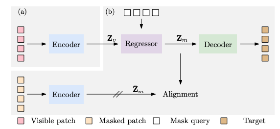

# 📘 Paper Notes – *Context Autoencoder for Self-Supervised Representation Learning*

* **Code**: [https://github.com/Atten4Vis/CAE](https://github.com/Atten4Vis/CAE)
* **Paper**: [arXiv:2202.03026](https://arxiv.org/pdf/2202.03026)
* **Authors**: Xiaokang Chen, Mingyu Ding, Xiaodi Wang, Ying Xin, Shentong Mo, Yunhao Wang, Shumin Han, Ping Luo, Gang Zeng

---
# keywrods
- pretrain learning
- self-supervised learning
- representation learning
- mask pretraining

## 🔍 What’s the paper about?

When I first saw this paper, I thought: *Yet another Masked Autoencoder variant?* But as I read more, I realized — **CAE is a subtle but meaningful step forward**.

The key idea? **CAE adds a new component called the "regressor"** between the encoder and decoder. Instead of letting the decoder recover the masked patches *directly* from visible patches (like in MAE), CAE takes a detour:

> It first **predicts the representations** of masked patches in the **semantic space**, and **only then** uses a decoder to reconstruct the pixel values from those representations.

This sounds minor, but it actually leads to a clear and intentional **decoupling of tasks** — a critical point I’ll touch on next.

---

## 🧠 Why does it matter?

In older models like MAE, the **encoder is burdened with both learning good representations and helping the decoder reconstruct pixels**. This can blur the line between semantic learning and low-level pixel pattern matching.

CAE fixes this by **separating responsibilities**:

* 🧠 **Encoder** focuses purely on learning semantic representations from visible patches.
* 🔄 **Regressor** bridges the gap — it predicts the latent features for the masked patches.
* 🎨 **Decoder** only handles the reconstruction job — turning the predicted features into pixels.

This way, **semantic learning and pixel reconstruction don’t interfere** with each other. That’s smart.

---

## 🛠️ How does it work? (My simplified understanding)

Here's how I’d explain the training flow:

1. **Step 1 – Encode visible patches**
   Feed the visible image patches into a Vision Transformer (ViT) encoder → get **visible patch representations**.

2. **Step 2 – Get ground-truth for masked patches**
   (For training only) The same encoder also processes masked patches to get their representations — but gradients don’t flow here.

3. **Step 3 – Regress masked representations**
   Now comes the cool part.
   A **regressor** takes:

   * The visible patch representations (as Key & Value)
   * A shared **learnable mask token** (as Query), plus its **positional embedding**

   These go into a cross-attention block to **predict the representations** of masked patches in the latent space.

4. **Step 4 – Decode from predicted representations only**
   The decoder **only takes the regressed (predicted) representations of masked patches**, *not* the visible patches — so it must rely on the regressor’s output to reconstruct.

5. **Step 5 – Compute loss**

   * 🧩 **Reconstruction loss**: between predicted pixels and original image patches
   * 🎯 **Alignment loss**: between regressed representations and ground-truth masked representations (from encoder)

---

## ❓What questions came to mind while reading?

### 1. Why doesn't the decoder use visible patch info?

At first, I was puzzled: *Wouldn’t the decoder do a better job if it had access to the full context — both visible and invisible representations?*

But then I got it: **if you give the decoder everything, it may just ignore the regressor altogether** and directly infer pixels from visible patches (cheating!). By restricting input to **only the regressed representations**, the decoder is *forced* to rely on the encoder + regressor to do the hard semantic lifting. Clever design!

---

### 2. Can semantic features really capture low-level structure like edges?

This is subtle.

When we humans imagine a missing part of an image, we don’t just guess *what* is there, but also *how it connects* to neighboring regions — we care about continuity.

If the regressed representations are **purely semantic**, how can the decoder recover sharp edges and boundary consistency between patches?

That made me wonder: maybe **the regressor’s output implicitly needs to retain some low-level (texture/edge) information** to help the decoder — even if it’s trained in a semantic alignment fashion.

Could we go one step further and **disentangle semantic and structural information** in the representations? That might lead to even better pretraining and more controllable features.

---

### 3. Are such representations really helpful for downstream tasks like detection/segmentation?

This one kept bugging me. Tasks like object detection and semantic segmentation **heavily depend on spatial precision**, low-level boundaries, and region consistency.

If the encoder is only trained to produce **semantically aligned representations**, is that enough?

But when I looked at the downstream performance, CAE actually **does really well on COCO and ADE20K** — even better than MAE and MoCo in many settings.

So maybe, by structuring the learning this way (semantic alignment + pixel reconstruction), CAE encourages representations that balance **semantic meaning and structural awareness** — even if it doesn’t explicitly disentangle them.

That’s quite impressive.

---

## 💭 Final thoughts

CAE might look simple — just an extra regressor — but it’s a thoughtfully designed step toward cleaner, more interpretable self-supervised learning. It clearly **encourages the encoder to focus on semantic representation**, which is key for transfer learning.

It also raised some exciting research directions for me:

* Can we explicitly separate semantic vs. low-level info in learned representations?
* How would CAE perform with **multi-modal targets** (e.g., language, CLIP features)?
* Could we use CAE-style decoupling in other domains — like video or audio?

Lots to think about. This is one of those papers where the more you understand the architecture, the more you appreciate its design.

Highly recommended read.
