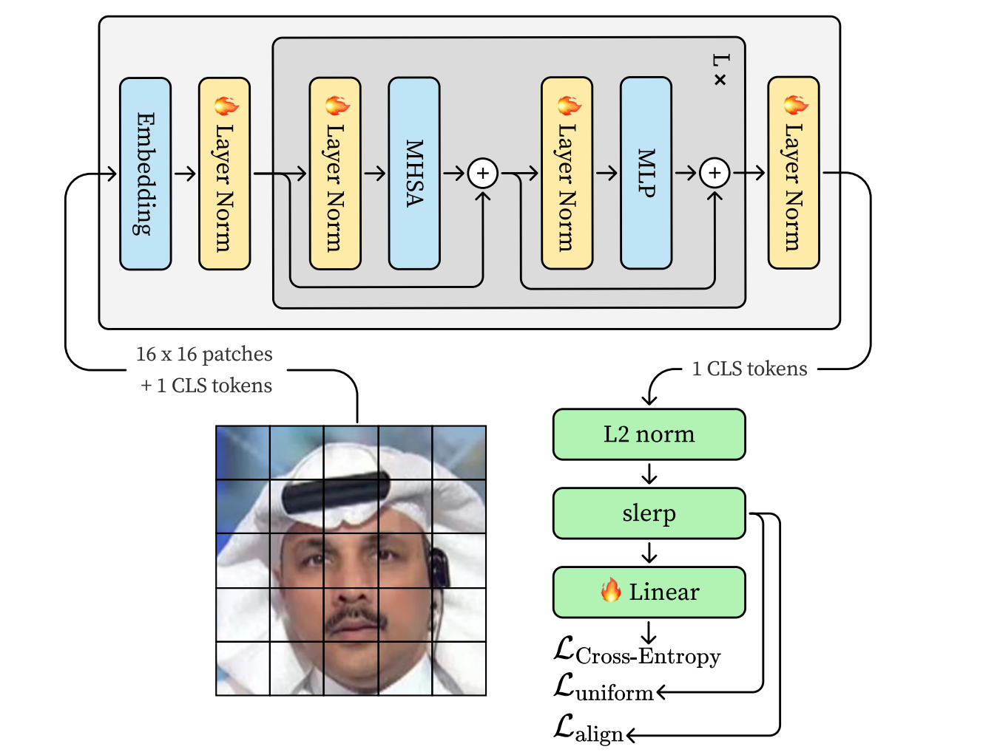

# Deepfake Detection that Generalizes Across Benchmarks*（LNCLIP-DF）

- paper: https://arxiv.org/pdf/2508.06248
- year: 2025-08
- author: Andrii Yermakov

## 一句话结论

作者用**极小改动**把 CLIP 变成强泛化的深伪检测器：只微调 **LayerNorm**（≈0.03% 参数），把 **CLS 特征做 L2 归一化**，在**球面**上做 **slerp** 潜空间增强，并加上**对齐+均匀性**损失。13 个基准（2019–2025）跨数据集测试，平均视频级 AUROC 与/超越 SOTA；并给出两个经验结论：**成对（real↔fake）训练数据**是泛化关键；“数据越新越难”并不成立。

## 方法核心（LNCLIP-DF）

| 组件       | 具体做法                                                         | 为什么这么做 / 作用                                      |
| -------- | ------------------------------------------------------------ | ------------------------------------------------ |
| 特征抽取     | 用 **CLIP ViT-L/14**，只取 **CLS token**，丢弃 patch tokens         | 借助大规模预训练视觉表示，减少任务特化过拟合。                          |
| 训练范围     | **仅训练所有 LayerNorm 的仿射参数 + 线性二分类头**（其余全冻结），总可训练参数≈**0.03%**   | 参数高效、稳定，不破坏 CLIP 先验。                             |
| L2 归一化   | 对 CLS 特征做 **L2 norm**，特征落在单位球面                               | 去幅值只留方向，形成“球冠”可分结构，利于泛化。                         |
| slerp 增强 | **同类样本**球面线性插值：$\text{slerp}(z_i,z_j;t)$；训练时扩批（128→**1024**） | 填补类内不同子簇间的空隙，特别是不同伪造器形成的子簇。                      |
| 损失       | 总损失：`CE + α·Alignment + β·Uniformity`，超参 **α=0.1, β=0.5**    | Alignment 拉近同类；Uniformity 在球面“推开”样本，二者形成“推—拉”平衡。 |
| 视频打分     | 每视频均匀取 **32 帧**，逐帧 softmax 后**求平均**                          | 简洁、无时间建模即可达标。                                    |

> **Uniformity/Alignment 的精确定义**与 slerp 公式均给出在论文式(1)–(4)：Uniformity 以 $\log \mathbb{E}\,\exp(-2\|z_x-z_y\|^2/2)$ 迫使特征在球面更均匀，Alignment 以二范数距离拉近同类对。

下面给出 **LNCLIP-DF** 的损失公式（按论文原文记号；$z$ 是 **L2 归一化**后的 CLS 特征）：

1. **特征与分类头**

$$
z_i=\frac{f(x_i)}{\lVert f(x_i)\rVert_2},\qquad
\ell_i = W^\top z_i + b,\qquad
p_i=\mathrm{softmax}(\ell_i)\in\mathbb{R}^2
$$

其中 $f(\cdot)$ 为 CLIP 视觉编码器的 CLS 向量。([arXiv][1])

2. **交叉熵（两类：real/fake）**

$$
\mathcal{L}_{\text{CE}}
= -\frac{1}{N}\sum_{i=1}^N
\Big[\; y_i\log p_i(\text{fake})+(1-y_i)\log p_i(\text{real}) \;\Big]
$$

（论文表述为对 fake/real 的 logits 使用交叉熵。）([arXiv][1])

3. **Alignment（同类拉近）**

$$
\mathcal{L}_{\text{align}}
=\mathbb{E}_{x,y\sim \mathcal{P}^{+}}
\left[\,\frac{\lVert z_x-z_y\rVert_2^2}{2}\,\right]
$$

$\mathcal{P}^{+}$ 表示同类（real-real 或 fake-fake）成对采样的分布。([arXiv][1])

4. **Uniformity（球面均匀化）**

$$
\mathcal{L}_{uniform}
=\log \;\mathbb{E}_{x,y\sim \mathcal{P}}
\left[ \exp\!\left(-\,\frac{2\lVert z_x-z_y\rVert_2^2}{2}\right) \right]
$$

$\mathcal{P}$ 为独立同分布采样；该项在单位超球面上“推开”样本。([arXiv][1])

5. **总损失（论文给定权重）**

$$
\boxed{\;
\mathcal{L}
= \mathcal{L}_{\text{CE}}
+ \alpha\,\mathcal{L}_{\text{align}}
+ \beta\,\mathcal{L}_{\text{uniform}},\quad
\alpha=0.1,\;\beta=0.5
\;}
$$

（权重取值与训练细节见原文。）([arXiv][1])

## 训练与数据设置（复现要点）

* **优化器与日程**：Adam(β₁=0.9, β₂=0.999, 无权衰减)，**bf16** 训练；**余弦循环**学习率：每个 cycle 先 1 epoch 从 $1e{-5}$ 线性升到 **3e-4**，再 9 epoch 余弦降回 $1e{-5}$；多数运行 **20 epoch**（两轮）已收敛；**batch=128**，slerp 扩展到 **1024**。
* **数据预处理**（DeepfakeBench 流程）：每视频均匀 **取32帧 → RetinaFace 最大脸 → 关键点对齐 → 1.3× 扩框 → 256×256 无损图**。
* **训练集**：遵循标准协议用 **FF++(c23)**；消融也试了 FFIW、DSv2。**验证集**自建（CDFv2、DSv1/DSv2、FFIW），避免 FF++ 验证集过近分布导致“看不出过拟合”。
* **数据成对（关键）**：训练集按 **real↔fake 源配对**构建（fake 来自对应 real 视频）。

---

## 结果与对比

**跨数据集（训练于 FF++）**：

* **CDFv2 96.5、DFD 97.3、DFDC 87.0、FFIW 93.5**（视频级 AUROC），在多数基准与/超越近期 SOTA（ForAda、Effort 等）。
* **大规模再评测**（涵盖 2019–2025 共 18 列数据集列）：LNCLIP-DF **Cross-dataset 平均 94.2**，优于 ForAda(91.5)、Effort(90.6)；In-dataset 也高。

**消融（逐步增益）**（跨数据集平均 AUROC）：

1. Baseline（线性头）**76.1** →
2. +LN **90.8** →
3. +L2 **91.8** →
4. +UnAl **92.1** →
5. +slerp **92.8**。典型集如 CDFv2：**78.8→93.1→94.5→94.3→96.5**。

**两条经验结论**：

* **成对训练**显著抑制捷径：非成对数据训练迅速“看起来学得更快”，但验证 AUROC 更低、过拟合更重；成对数据更稳更高（训练/验证曲线见 Fig.3）。
* **“越新越难”并不单调**：仅在最新 DSv2 上训练，对旧集（FF++、DFDM、CDFv2）泛化差；反而在较早但多样的 FF++ 训练，对多个新老数据集**更稳/更优**（Fig.4）。

## 我该如何理解三个关键“小招数”

* **L2 归一化**：把 CLS 投到单位球面，分类变成“分离球冠”，幅值不再诱导过拟合；与线性头天然契合。
* **Uniformity + Alignment**：在球面上**推开一切样本**（Uniformity）同时**拉近同类**（Alignment），实现“推—拉”平衡；论文用 **α=0.1, β=0.5**。
* **slerp（球面插值）**：按夹角做**等角速度**插值，生成同类的“中间样本”，连通类内不同伪造指纹子簇，训练期扩批到 1024。

## 边界与不足（直说）

* **鲁棒性未系统评测**：尚未针对**对抗扰动/强退化**做系统实验。
* **时间维缺失**：视频级只做帧概率平均，可能错过时序线索（口型/同步等）。
* **依赖人脸检测/对齐**：遮挡、低清、错检会掉点。
* **训练人群多样性有限、增量学习未解**：实际部署可能出现偏置与“新伪造”持续演进问题。

[1]: https://arxiv.org/pdf/2508.06248 "Deepfake Detection that Generalizes Across Benchmarks"
