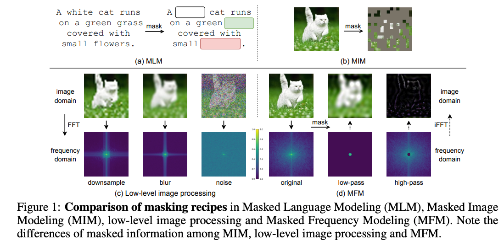
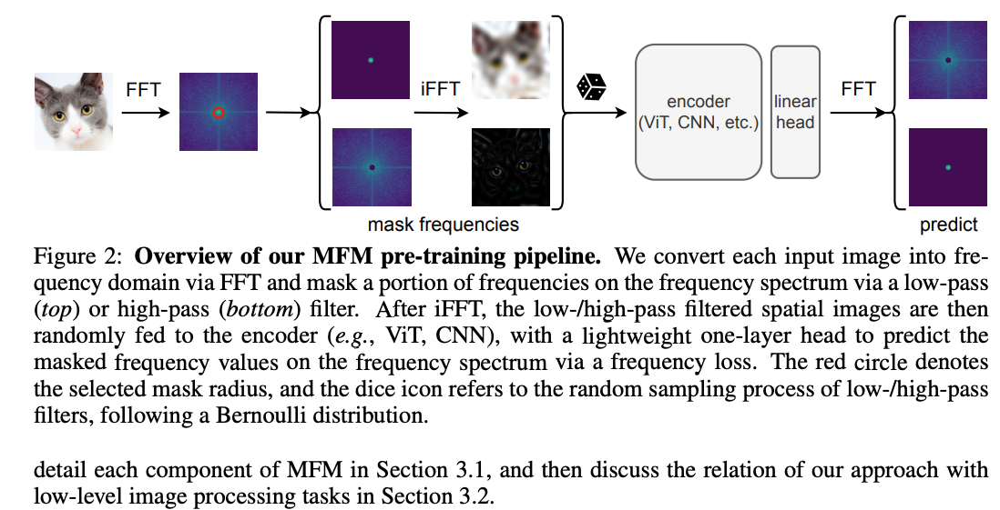

# Title

**Masked Frequency Modeling for Self-Supervised Visual Pre-Training**

* Paper: [arXiv:2206.07706](https://arxiv.org/pdf/2206.07706)
* Project: [MFM Project Page](https://www.mmlab-ntu.com/project/mfm/index.html)

# Authors

* Jiahao Xie
* Wei Li
* Xiaohang Zhan
* Ziwei Liu
* Yew Soon Ong
* Chen Change Loy

# keywrods
- pretrain learning
- self-supervised learning
- representation learning
- mask pretraining
- frequency representation learning

# Reflection

After reading this paper, I found the authors’ perspective on self-supervised visual pre-training both interesting and thought-provoking. They point out that most existing masked modeling methods—like Masked Language Modeling (MLM) and Masked Image Modeling (MIM)—are based on the corrupt-and-predict paradigm, where a portion of the input is masked and the model is trained to reconstruct the missing information.

What really caught my attention is their argument that corrupting images in the **spatial domain** makes it hard to precisely analyze or control which specific image information gets corrupted. Although, in principle, we can reason about some spatial corruptions (for instance, we know downsampling destroys high-frequency details), directly analyzing or manipulating frequency content is much easier and more interpretable in the frequency domain.

This idea made me realize that switching from spatial to frequency-domain masking might lead to more effective and controllable pre-training tasks.

# Approach

Here’s how I understand their method:

1. First, they transform each image into the frequency domain using the Fast Fourier Transform (FFT).
2. They then apply a frequency mask—essentially a low-pass filter with a configurable radius—to separate the spectrum into high-frequency (outside the mask) and low-frequency (inside the mask) components.
3. Next, they apply the inverse FFT (iFFT) to bring the masked spectrum back to the spatial domain. This produces images where either high- or low-frequency information is missing.
4. These “corrupted” images are then fed into an image encoder and a linear head, which are trained to reconstruct the original images.
5. The loss is calculated as the L2 difference between the predicted and original FFT components (real and imaginary), focusing on the masked frequency regions depending on which mask was applied. It’s worth noting that when generating the input images with missing frequencies, only the real part is used after the iFFT.

# My Questions & Thoughts

As I was reading, several questions and ideas came to mind:

* Why don’t CNNs show any improvement under this framework?
    This is probably that the CNN is natraully the low-frequence filter. This will result that CNN cannot learn high frequency model with only low frequency info. Refer this paper for more details https://arxiv.org/pdf/1901.06523
* Why do they only keep the real part after iFFT for the input images?
* Why not directly use spectral data (frequency domain) as input and output for the network, instead of converting back to the spatial domain?

# Ideas for Improvement

Thinking further, I came up with a few potential improvements:

* **Patch-level Frequency Masking:**
  What if we divided each image into patches and applied FFT to each patch individually? This could help the model learn both local and global frequency information. It also seems like a natural fit for patch-based architectures like ViT, and could be useful for anomaly detection with contrastive learning between local patterns.

* **Training Efficiency:**
  In MAE, we can skip computation on masked areas. For MFM, though, every position is involved in the computation. I wonder if it’s possible to design a spectral-domain MAE, so we could ignore masked frequencies and reduce computation during training.

* **Filter Design:**
  Instead of just using a simple low-pass filter, what if we experimented with band-pass filters to focus on mid-frequency components? That might reveal new insights into how different frequency bands contribute to pre-training.

* **Spectral Representation:**
  The paper primarily uses real and imaginary components of the spectrum, but I think it might be worth exploring the use of both magnitude and phase, since they correspond directly to image brightness and structure (like contours and silhouettes).
