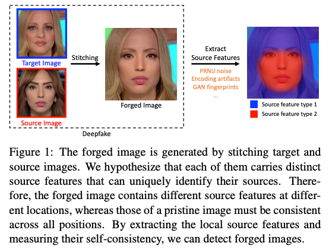
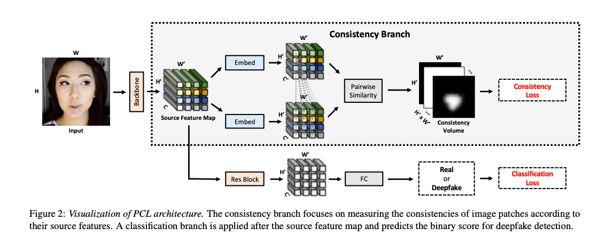

# Learning Self-Consistency for Deepfake Detection

*Tianchen Zhao, Xiang Xu, Mingze Xu, Hui Ding, Yuanjun Xiong, Wei Xia (Amazon/AWS AI)*
[arXiv link](https://arxiv.org/pdf/2012.09311)

---

## 1. Why Is This Paper Important?

With the continuous evolution of deepfake techniques, simply detecting visual artifacts is getting harder. This paper proposes a **new angle**: Instead of looking for specific visual flaws, it looks for **inconsistencies in the underlying “source features”** within an image. This idea is based on the observation that current deepfakes—especially those created by swapping or modifying faces—often stitch together content from different sources, which can leave behind traces that are hard to erase completely.

**Key takeaway:**

> The method is powerful for today’s face-swap/face-modification deepfakes, but as attackers adopt full-face synthesis methods (like GANs), this inconsistency cue may fade away.

---

## 2. What Are the Four Types of Deepfakes?

The paper clarifies that “deepfake” is not just one thing. There are four main types:

1. **Entire Image Synthesis** (e.g., GAN-generated faces, StyleGAN):
   The whole face/image is generated from scratch.
2. **Modification of Facial Attributes** (e.g., changing age, gender):
   Only certain attributes are altered.
3. **Modification of Facial Expression** (e.g., changing smile to frown):
   Expression is changed, but identity remains.
4. **Face Identity Swap** (face-swapping):
   The identity of a person in a photo or video is swapped with another.

> **This paper’s method is especially effective for types 2, 3, and 4.**
> **It is NOT designed for “entire image synthesis” (type 1), where the whole image is generated by a GAN and is internally consistent.**

---

## 3. Main Approach

### a. **Pairwise Self-Consistency Learning (PCL)**

* The model splits an image into patches and learns to extract a “source feature” from each patch.
* It then compares every patch to every other patch, measuring how “consistent” their source features are.
* In a real image, all regions should have highly consistent features.
  In a stitched or swapped deepfake, some regions will be different, revealing the forgery.

### b. **Inconsistency Image Generator (I2G)**

* To train the PCL model, you need ground-truth information about which parts of the image are fake.
* I2G is a data synthesis technique: it creates training data by blending regions from different faces, generating both the fake image and a precise mask of which pixels are manipulated.
* This enables supervised training without needing to manually annotate real-world deepfake datasets.

---

## 4. Network Design & Patch Size

* The backbone is a standard ResNet (e.g., ResNet-34), but you can swap in any network.
* Patch size affects performance:

  * **Smaller patches:** More fine-grained, but costlier and may lack global info.
  * **Larger patches:** Faster, but risk missing subtle inconsistencies.
  * **Results on FF++ dataset:**

    * 4×4 patch: 98.32% AUC
    * 8×8 patch: 98.35% AUC
    * 16×16 patch: **99.11% AUC (best)**
    * 32×32 patch: 98.74% AUC

---

## 5. Results (How Well Does It Work?)

**The most important metric:**

> **Cross-dataset AUC** — can the model detect deepfakes made with *unseen* methods or on new datasets?

* **DFDC (Deepfake Detection Challenge):**

  * PCL+I2G (2020): **67.52%**
  * LaaNet (2024): **86.94%**  *(for comparison; much improved with newer methods)*
* **DFD (Google Deepfake Detection):**

  * PCL+I2G: **99.07%**

The method **outperforms previous works** in cross-dataset settings (except on the newest, hardest datasets), but as the field evolves, the numbers are starting to look lower versus the latest methods.

---

## 6. Strengths and Limitations

**Strengths:**

* New detection angle — focuses on *source feature inconsistency*, rather than just visual artifacts.
* Strong cross-dataset generalization (especially for face-swap/modification forgeries).
* Can localize fake regions for interpretability.

**Limitations:**

* Ineffective for entire GAN-generated faces (type 1), as those are internally consistent.
* Performance drops for low-quality or highly compressed images.
* As forgery tech advances, forgers may learn to erase even these subtle inconsistencies.

---

## 7. What Should You Remember?

* **If the deepfake is made by patching together different real images, source feature inconsistency is a powerful detection signal.**
* **If the deepfake is generated end-to-end by a GAN, this approach may not work.**
* The paper’s method was **state-of-the-art for 2020**, but newer methods are catching up, especially on hard datasets like DFDC.
* **Key design choice: the patch size affects both detection power and efficiency.**

---

### TL;DR (One-Sentence Summary)

> **This paper proposes to detect deepfakes by measuring the self-consistency of “source features” in an image, a method that excels at catching face swaps and modifications but is less effective as forgeries shift toward full GAN-generated faces.**
