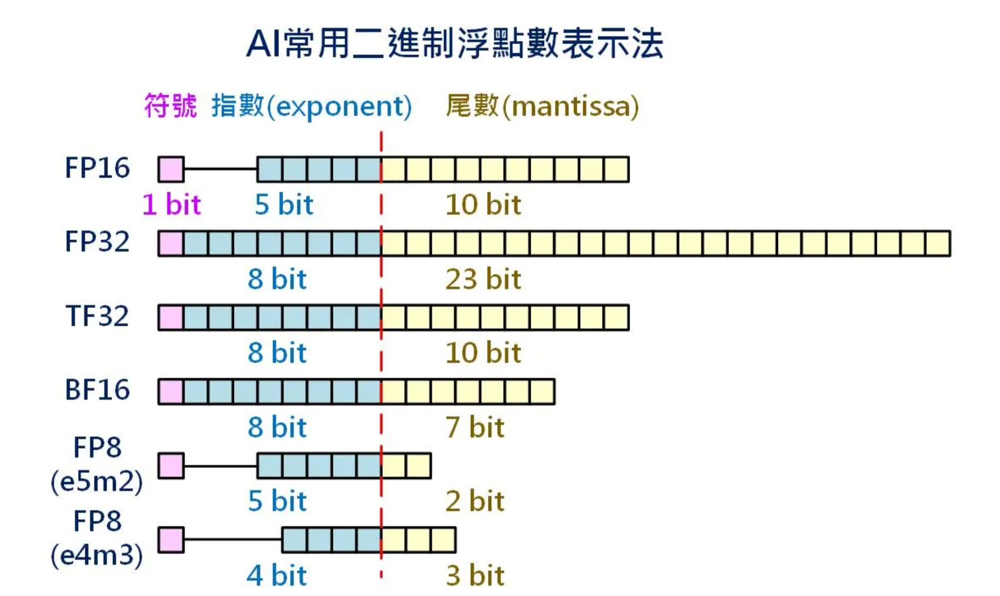
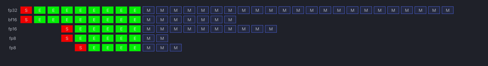
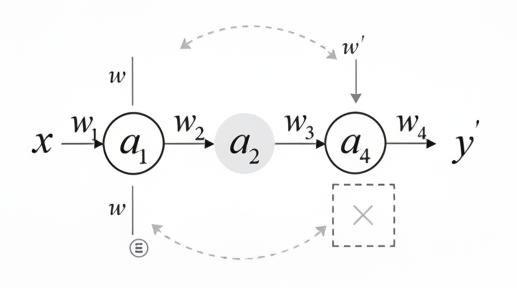

# Memory-Efficient Deep Learning: Key Techniques Explained

Training modern deep learning models is expensive — they eat up GPU memory fast. Fortunately, there are techniques that help us train larger models faster while consuming fewer resources. Let’s break down some of the most important ones.


## 1. Data Parallelism (DP) vs Distributed Data Parallel (DDP) vs Fully Sharded Data Parallel (FSDP)

| Method   | How it works                                                                                                       | Pros                                                 | Cons                                        |
| -------- | ------------------------------------------------------------------------------------------------------------------ | ---------------------------------------------------- | ------------------------------------------- |
| **DP**   | Splits input data across GPUs, but keeps a full copy of the model on each GPU.                                     | Easy to implement, simple                            | High memory usage (model fully replicated)  |
| **DDP**  | Each GPU runs a copy of the model and computes gradients on its shard of data. Gradients are averaged across GPUs. | Efficient, scales well, widely used                  | Still replicates the full model on each GPU |
| **FSDP** | Splits both the **model parameters** and **gradients** across GPUs, only loading/sharing shards when needed.       | Huge memory savings, enables training massive models | More complex setup, communication overhead  |

### DP
**Data Parallel (DP) — Principle, Steps, Pros/Cons**

#### Core idea

* **Replicate the full model on every GPU.**
* **Split the input batch** into mini-batches, dispatch one per GPU for forward & backward.
* **Gather gradients on device\[0]**, update there, **broadcast updated weights** back to other GPUs.

#### One training iteration (matches 1/2/3 in the diagram)

1. **Parallel compute (red):**
   Each GPU runs forward → loss → backward, producing its local gradient $g_i$.
2. **Gradient aggregation (light blue):**
   All $g_i$ are copied to **device\[0]** and reduced (sum/mean) to global gradient $g$.
3. **Update & broadcast (green):**
   On **device\[0]**, update parameters $\theta \leftarrow \theta - \eta g$;
   broadcast the new $\theta$ to all other GPUs.

#### Pseudocode (simplified)

```python
# model replicated on each GPU
grads = [backward(model_i(x_i)) for i in gpus]  # 1
g = reduce_to_device0(grads, op="mean")         # 2
theta0 = optimizer_update(theta0, g)            # 3
broadcast(theta0, to=gpus[1:])
```

#### Advantages

* Very easy to use (PyTorch `DataParallel`), minimal code changes.
* Leverages multiple GPUs for forward/backward in parallel.

#### Limitations / Pitfalls

* **High memory**: full model copy on every GPU.
* **Bottleneck on device\[0]**: centralized gradient reduction & update.
* Extra **tensor copies** → bandwidth-sensitive; single-process/GIL overhead.
* In practice, **slower and less scalable than DDP**.


### DDP


#### Core Idea

* **DDP (DistributedDataParallel):**

  * Spawns **one process per GPU** (single-process-single-GPU).
  * Each process has a **full model replica** and trains on a **unique shard of the dataset**.
  * Forward pass is independent; during backward pass, gradients are synchronized across all processes.

* **DP (DataParallel):**

  * Uses **a single process with multiple threads** across GPUs.
  * Model lives on the main GPU; input batches are split and dispatched to other GPUs.
  * Gradients are gathered back on the main GPU and averaged.


#### Workflow of DDP

| Stage                        | Operation                                                  | Notes                                      |
| ---------------------------- | ---------------------------------------------------------- | ------------------------------------------ |
| **Initialization**           | `DDP(model)` broadcasts model parameters to all processes. | Ensures identical start across GPUs.       |
| **Forward pass**             | Each process runs forward with its data shard.             | Dataset is split via `DistributedSampler`. |
| **Backward pass**            | Each process computes gradients locally.                   | Hooks are attached to parameters.          |
| **Gradient synchronization** | DDP uses **AllReduce** to average gradients across GPUs.   | Typically with **NCCL backend**.           |
| **Parameter update**         | Optimizer in each process updates local model.             | Parameters remain identical everywhere.    |

#### Key Mechanisms

* **AllReduce**: Efficient peer-to-peer communication; every process ends up with identical averaged gradients.
* **Overlap of compute & communication**: Starts gradient communication while later layers still compute backprop.
* **Buckets**: Gradients are grouped to reduce communication overhead.
* **Reducer module**: Manages gradient hooks, bucket scheduling, and AllReduce calls.

---

#### DDP vs DP

| Aspect             | DataParallel (DP)                                                                | DistributedDataParallel (DDP)            |
| ------------------ | -------------------------------------------------------------------------------- | ---------------------------------------- |
| **Process model**  | Single process, multi-threaded                                                   | Multi-process, one process per GPU       |
| **Model copy**     | Master GPU holds model; other GPUs get temporary replicas                        | Each process holds a full model replica  |
| **Gradient sync**  | Gather on master GPU, then broadcast                                             | AllReduce (peer-to-peer, more efficient) |
| **Bottlenecks**    | GIL (Python Global Interpreter Lock), CPU-GPU communication, master GPU overload | Minimal bottleneck, scales well          |
| **Scalability**    | Single machine, multi-GPU only                                                   | Multi-machine, multi-GPU supported       |
| **Performance**    | Slower, poor scaling beyond few GPUs                                             | Faster, near-linear scaling with GPUs    |
| **Recommendation** | Legacy, simple testing                                                           | Production training, large-scale setups  |

#### Ring All-Reduce


### FSDP


#### What is FSDP?

* **DDP** keeps **full model replicas** on each GPU. Memory = O(model size) per GPU.
* **FSDP** goes further: it **shards parameters, gradients, and optimizer states across GPUs**.

  * Each GPU only stores **1/N** of the full model states (where N = number of GPUs).
  * Parameters are **sharded at rest**, and **gathered only when needed** for forward/backward compute.
  * This enables training models that would not fit on a single GPU.


#### Workflow (4 GPUs Example)

Let’s assume:

* Model has 100M parameters.
* We train on 4 GPUs (ranks 0,1,2,3).

##### 🔹 Step 1. Parameter & Data sharding


* Each GPU holds **25M parameters** (1/4 of the model).
* The other 75M are **not resident** on that GPU until needed.
* Parameters are stored in **sharded form**:

  * GPU0 → shard0, GPU1 → shard1, GPU2 → shard2, GPU3 → shard3.
* Each GPU holds 1/4 data shard. Note that the data is always processed in parallel and will never synchronize across GPUs. Just keep in mind that each GPU has its own batch data


##### 🔹 Step 2. Forward pass
* Before computing a layer, FSDP triggers **all-gather**: each GPU temporarily fetches all shards for that layer → now every GPU has the full parameter set for that layer.

* Compute proceeds locally on each GPU’s data shard.
* After use, parameters can be released (to save memory).

##### 🔹 Step 3. Backward pass

* Run **all-gather** to collect complete parameters

* Gradients are computed locally for each data shard.
* FSDP performs a **reduce-scatter**: instead of every GPU having the full gradient, each GPU keeps only the shard corresponding to its parameters.

  * Example: GPU0 ends up with gradients for shard0 only.

##### 🔹 Step 4. Optimizer step

* Optimizer states (e.g. Adam’s momentum/variance) are also sharded.
* Each GPU updates only its shard of parameters with its shard of optimizer states.
**End result:**

* No GPU ever holds the full set of parameters/gradients/optim states in memory.
* Communication pattern = **AllGather (forward)** + **ReduceScatter (backward)**.


Note that in FSDP, parameter gathering is done layer by layer (module by module), not for the whole model at once.

- Example: 3-layer model on 4 GPUs
  Suppose model = [Linear1, Linear2, Linear3], each wrapped by FSDP.

    - Forward timeline
        - Step 1: Gather weights of Linear1 → compute → reshard.
        - Step 2: Gather weights of Linear2 → compute → reshard.
        - Step 3: Gather weights of Linear3 → compute → reshard.

    - Backward timeline

        - Step 1: Gather weights of Linear3 → compute grad → reduce-scatter.
        - Step 2: Gather weights of Linear2 → compute grad → reduce-scatter.
        - Step 3: Gather weights of Linear1 → compute grad → reduce-scatter.


#### How to split shards of parameters in FSDP
FSDP represents a unit with a FlatParameter, which is a 1-D tensor formed by flattening and concatenating n model parameter tensors. For example, if the unit is a LlamaDecoderLayer, then all its weights—q_proj, k_proj, v_proj, o_proj, gate_proj, up_proj, down_proj, and all layer norm weights—are flattened and concatenated into one large 1-D tensor. This 1-D tensor is then evenly partitioned across ranks; if its length isn’t divisible by the number of ranks, it is padded first and then split, so each rank maintains a shard tensor called the local shard. Note that this 1-D tensor shares memory with the original model parameters, so it does not allocate additional memory.


#### Computation and Communication Overlapping
FSDP pipelines parameter communication (all-gather / reduce-scatter) with layer computation, so GPUs don't sit idle waiting for communication to finish.
- **Forward**
    - While GPU is computing layer L, FSDP can already prefetch parameters of layer L+1 using all-gather.
    - Controlled by forward_prefetch=True.
    - This hides communication latency behind compute.
- **Backward**
    - During backprop, when gradients for a layer are ready, FSDP immediately launches a reduce-scatter for that layer’s grads.
    - Meanwhile, backprop continues computing gradients for earlier layers.
    So gradient communication overlaps with ongoing gradient computation.
- **Non-overlapping**

- **Overlapping**


#### Comparison: FSDP vs DDP

| Feature           | DDP                           | FSDP                                  |
| ----------------- | ----------------------------- | ------------------------------------- |
| Parameter storage | Full copy on every GPU        | Sharded across GPUs (1/N each)        |
| Gradient storage  | Full copy per GPU             | Sharded (reduce-scatter)              |
| Optimizer states  | Full copy per GPU             | Sharded                               |
| Communication pattern     | AllReduce                     | AllGather (fwd/bwd) + ReduceScatter (bwd) |
| Memory efficiency | O(model size)                 | O(model size / N)                     |
| Best for          | Models that fit in GPU memory | Very large models                     |


### Usage of DP, DDP, and FSDP
**1. DP**
```
# train_dp.py
...
model = nn.DataParallel(model)  # splits on dim=0 by default
...
```

```
python train.py
```
**2. DDP**
```
# train_ddp.py
import os
import torch
import torch.nn as nn
import torch.distributed as dist
from torch.nn.parallel import DistributedDataParallel as DDP
from torch.utils.data import DataLoader, TensorDataset, DistributedSampler

def setup():
    # torchrun sets these env vars
    rank = int(os.environ["RANK"])
    world_size = int(os.environ["WORLD_SIZE"])
    local_rank = int(os.environ["LOCAL_RANK"])
    dist.init_process_group(backend="nccl")  # use "gloo" if no GPUs
    torch.cuda.set_device(local_rank)
    return rank, world_size, local_rank

def cleanup():
    dist.destroy_process_group()

class SmallNet(nn.Module):
    ...

def main():
    rank, world_size, local_rank = setup()
    ..
    # Each process sees a unique shard
    sampler = DistributedSampler(ds, num_replicas=world_size, rank=rank, shuffle=True, drop_last=False)
    loader = DataLoader(ds, batch_size=256, sampler=sampler, num_workers=2, pin_memory=True)

    # ---- model/optim ----
    device = torch.device(f"cuda:{local_rank}" if torch.cuda.is_available() else "cpu")
    model = SmallNet().to(device)
    model = DDP(model, device_ids=[local_rank], output_device=local_rank)
    opt = torch.optim.SGD(model.parameters(), lr=1e-2)
    crit = nn.CrossEntropyLoss()

    model.train()
    for epoch in range(2):
        sampler.set_epoch(epoch)  # ensure different shuffles each epoch across ranks
        for xb, yb in loader:
            xb = xb.to(device, non_blocking=True)
            yb = yb.to(device, non_blocking=True)

            opt.zero_grad(set_to_none=True)
            logits = model(xb)     # backward hooks will trigger AllReduce on grads
            loss = crit(logits, yb)
            loss.backward()
            opt.step()

        # Only rank 0 prints to avoid clutter
        if rank == 0:
            print(f"[DDP] epoch {epoch} loss {loss.item():.4f}")

    cleanup()
```

```
torchrun --standalone --nproc_per_node=2 train_ddp.py
```

**3. FSDP**

```python
# train_fsdp.py
import torch
import torch.nn as nn
import torch.distributed as dist
from torch.distributed.fsdp import FullyShardedDataParallel as FSDP
from torch.distributed.fsdp.wrap import wrap
from torch.utils.data import DataLoader, DistributedSampler, TensorDataset

def setup():
    dist.init_process_group("nccl")
    torch.cuda.set_device(int(os.environ["LOCAL_RANK"]))

def cleanup():
    dist.destroy_process_group()

def main():
    setup()
    rank = dist.get_rank()
    local_rank = int(os.environ["LOCAL_RANK"])
    device = torch.device(f"cuda:{local_rank}")

   ...

    sampler = DistributedSampler(ds)
    loader = DataLoader(ds, batch_size=16, sampler=sampler)

    # model
    model = BigNet().to(device)
    # Wrap with FSDP (auto-shard parameters across ranks)
    model = FSDP(model)

    opt = torch.optim.Adam(model.parameters(), lr=1e-3)
    crit = nn.CrossEntropyLoss()

    model.train()
    for epoch in range(2):
        sampler.set_epoch(epoch)
        for xb, yb in loader:
            xb, yb = xb.to(device), yb.to(device)
            opt.zero_grad()
            out = model(xb)
            loss = crit(out, yb)
            loss.backward()
            opt.step()
    cleanup()

if __name__ == "__main__":
    main()
```

**Run with 4 GPUs:**

```bash
torchrun --standalone --nproc_per_node=4 train_fsdp.py
```


## 2. Low-Precision Training: FP4 & FP8 Quantization

### Different Numeric Formats

| Format   | Bits | Structure                                | Range                                | Precision                                                      |
| -------- | ---- | ---------------------------------------- | ------------------------------------ | -------------------------------------------------------------- |
| **FP32** | 32   | 1 sign, 8 exponent, 23 mantissa          | \~1e−38 to 1e38                      | Very high                                                      |
| **FP16** | 16   | 1 sign, 5 exponent, 10 mantissa          | \~6e−5 to 6e4                        | Lower precision, limited range                                 |
| **BF16** | 16   | 1 sign, 8 exponent, 7 mantissa           | \~1e−38 to 1e38 (same range as FP32) | Precision lower than FP32, higher than FP16 in range stability |
| **FP8**  | 8    | Typically 1 sign, 4 exponent, 3 mantissa | Smaller range                        | Very coarse                                                    |
| **FP4**  | 4    | 1 sign, 2 exponent, 1 mantissa           | Extremely small                      | Very coarse                                                    |
| **INT8** | 8    | Integer, −128 to 127 (or 0–255)          | Fixed range                          | Exact integers, no fractions                                   |
| **INT4** | 4    | Integer, −8 to 7 (or 0–15)               | Tiny range                           | Exact integers                                                 |

### Float Representation



### Calculation Formula
#### FP32 (IEEE 754 Single Precision)

Formula:
$$
\text{value} = (-1)^{\text{sign}} \times 2^{(E-127)} \times \left(1 + \sum_{i=1}^{23} b_i \cdot 2^{-i}\right)
$$

* 1 sign bit
* 8 exponent bits (bias = 127)
* 23 fraction (mantissa) bits


#### FP16 (Half Precision)


Formula:
$$
\text{value} = (-1)^{\text{sign}} \times 2^{(E-15)} \times \left(1 + \sum_{i=1}^{10} b_i \cdot 2^{-i}\right)
$$

* 1 sign bit
* 5 exponent bits (bias = 15)
* 10 fraction bits

---

#### BF16 (Brain Floating Point)

$$
\text{value} = (-1)^{\text{sign}} \times 2^{(E-127)} \times \left(1 + \sum_{i=1}^{7} b_i \cdot 2^{-i}\right)
$$

* 1 sign bit
* 8 exponent bits (same bias as FP32 → wide range)
* 7 fraction bits (reduced precision vs FP32)

#### TF32 (TensorFloat-32)

$$
\text{value} = (-1)^{\text{sign}} \times 2^{(E-127)} \times \left(1 + \sum_{i=1}^{10} b_i \cdot 2^{-i}\right)
$$

* Stored as FP32 in memory
* **Used in compute on Tensor Cores**:

  * 1 sign bit
  * 8 exponent bits
  * 10 mantissa bits (rest truncated)
* Accumulation done in FP32


#### FP8 (Two Variants)

* **E5M2**: 1 sign, 5 exponent (bias = 15), 2 mantissa

  $$
  \text{value} = (-1)^{\text{sign}} \times 2^{(E-15)} \times \left(1 + \sum_{i=1}^{2} b_i \cdot 2^{-i}\right)
  $$
* **E4M3**: 1 sign, 4 exponent (bias = 7), 3 mantissa
Let:
    * $s$ = sign bit
    * $E$ = exponent field (4 bits, unsigned)
    * $M$ = mantissa field (3 bits, unsigned integer)
    * $m = 3$ (mantissa bits)

- **Normal numbers** ( $1 \leq E \leq 14$ )
Exponent neither all-zeros nor all-ones:

$$
x = (-1)^s \times 2^{(E - 7)} \times \left(1 + \frac{M}{2^3}\right)
$$

- **Subnormal numbers** ( $E = 0, M \neq 0$ )
Exponent is all zeros, but mantissa nonzero:

$$
x = (-1)^s \times 2^{(1 - 7)} \times \frac{M}{2^3}
$$


- **Zero** ( $E = 0, M = 0$ )

$$
x = (-1)^s \times 0
$$

- **Special case: all exponent bits = 1** ( $E = 15$ )
    * If $M = 111_2$: **NaN**
    * Else ($M \neq 111$): **treated as normal number** (different from IEEE-754!)

    So:
    $$
    x =
    \begin{cases}
    \text{NaN}, & E=15, M=7 \\
    (-1)^s \times 2^{(15-7)} \times \left(1 + \frac{M}{2^3}\right), & E=15, M \neq 7
    \end{cases}
    $$

- **Summary**

$$
x =
\begin{cases}
(-1)^s \times 2^{E-7} \times \Big(1+\tfrac{M}{8}\Big), & 1 \leq E \leq 14 \\
(-1)^s \times 2^{-6} \times \tfrac{M}{8}, & E=0, M \neq 0 \\
(-1)^s \times 0, & E=0, M=0 \\
\text{NaN}, & E=15, M=7 \\
(-1)^s \times 2^{8} \times \Big(1+\tfrac{M}{8}\Big), & E=15, M \neq 7
\end{cases}
$$


✅ Compared with **E5M2**, the big difference is:

* E5M2 uses IEEE-style ±∞ and NaN encodings.
* E4M3 does **not** have infinities — exponent=all-ones still encodes finite normals (except one NaN pattern).

Here’s a **concise table** of **E4M3 examples** covering all the important cases:


| Case| Bits (s \| E \| M)| Interpretation| Value|
|-------|---------|------------|-----------|
| **Normal (small)** | `0 \| 0110 \| 100` (s=0, E=6, M=4) | $2^{6-7} \times (1+4/8)$               | **+0.75**                      |
| **Normal (larger)** | `1 \| 1010 \| 011` (s=1, E=10, M=3) | $-2^{10-7} \times (1+3/8)$             | **-11.0**                      |
| **Subnormal**   | `0 \| 0000 \| 010` (s=0, E=0, M=2) | $2^{1-7} \times (2/8)$                 | **+0.0039** (≈1/256)           |
| **Zero**        | `0 \| 0000 \| 000`                | Special encoding                          | **+0.0** (or −0.0 if s=1)      |
| **Max normal**  | `0 \| 1111 \| 110` (s=0, E=15, M=6) | $2^{15-7} \times (1+6/8)$              | **+448** (largest finite)       |
| **NaN**         | `0 \| 1111 \| 111`                | Special encoding                          | **NaN** (Not a Number)         |


#### FP4

* Example format: 1 sign, 2 exponent (bias = 3), 1 mantissa

$$
\text{value} = (-1)^{\text{sign}} \times 2^{(E-3)} \times \left(1 + b_1 \cdot 2^{-1}\right)
$$

(Experimental, details may vary by hardware vendor.)


#### INT8

$$
\text{value} = s \times 2^{-scale}
$$

where $s \in [-128, 127]$.

* 8 bits, stored as integers.
* No exponent/fraction, just scaled integer representation.


#### INT4

$$
\text{value} = s \times 2^{-scale}, \quad s \in [-8, 7]
$$

* Same as INT8, but with 4 bits.
* Very coarse precision.

Instead of using standard FP32 (32-bit floats), models can run with fewer bits per number:

| Format          | Bits | Memory Saved  | Use Case                                        |
| --------------- | ---- | ------------- | ----------------------------------------------- |
| **FP16 / BF16** | 16   | \~50% vs FP32 | Today’s standard for training                   |
| **FP8**         | 8    | \~75% vs FP32 | Training & inference, NVIDIA H100 supports this |
| **FP4**         | 4    | \~87% vs FP32 | Mostly research/prototype, very aggressive      |

Lower precision = smaller tensors = less GPU memory + faster compute.
Modern hardware (like NVIDIA H100) makes FP8 training practical. FP4 is still experimental, but very promising.

### FP8 Quantization


When doing matrix multiplication in FP8, the original tensors $a$ and $b$ start as FP32 values. To fit them into FP8’s limited range, each tensor is divided by a scaling factor, giving scaled versions $A = a / S_a$ and $B = b / S_b$. These scaled values are then rounded and stored in FP8. During computation, the Tensor Cores multiply the FP8 numbers $A$ and $B$, but internally the accumulation happens in higher precision (FP16 or FP32) to avoid large numerical errors. Mathematically, what’s really being summed is $\sum_k (a_{ik}/S_a) \cdot (b_{kj}/S_b)$. After the accumulation is complete, the result is multiplied by $S_a \cdot S_b$ to “unscale” it back into the correct numerical range. At this point, the result can either be kept in higher precision for further use or re-quantized into FP8 with a new scale factor if storage efficiency is the priority.

### INT8 Quantization

**The math (linear quantization)**
$$
x_q=\text{round}\!\left(\frac{x}{\text{scale}}\right) \;\;(\text{and optional }+\text{zero\_point})\quad
\hat x = x_q \times \text{scale}
$$

During GEMM: **int8 × int8 → int32 accumulate**, then (if needed) **dequantize** back to FP. Hardware uses **DP4A/IMMA** instructions to do many 8-bit MACs per cycle; the accumulator is **int32** so you don't overflow when summing products. [1]

Map FP tensors to **signed INT8** with a learned **scale** (and optional zero-point), run **int8 matmuls on Tensor Cores / DP4A/IMMA**, **accumulate in int32**, then dequantize (or keep int8) for the next ops. [1]

#### Two Ways to Enable INT8 in TensorRT


| Path                            | How scales are set                                                                                                                                                                                             | When to use                                                                                |
| ------------------------------- | -------------------------------------------------------------------------------------------------------------------------------------------------------------------------------------------------------------- | ------------------------------------------------------------------------------------------ |
| **Implicit quantization (PTQ)** | Provide a **calibrator** and a **representative dataset**; TRT measures activation ranges and writes a **calibration cache**; weights are quantized (often per-channel) and activations per-tensor by default. | Fastest path from FP model → INT8 engine; no graph edits. [2]               |
| **Explicit Q/DQ (PTQ or QAT)**  | The model **contains Quantize/DeQuantize (Q/DQ) nodes** (e.g., from ONNX/PTQ or **QAT**). TRT uses those scales directly—**no calibrator needed**.                                                             | Preferred for production (scales are under your control; reproducible). [2] |


> In both modes, TensorRT chooses per-layer kernels and will run a layer in INT8 only if it's actually faster and supported; otherwise it falls back to FP16/FP32. [3]
#### PTQ (Post-Training Quantization)

Here's the **PTQ (Post-Training Static Quantization) flow** in the PyTorch diagram, step-by-step and concise:

| Step                                                    | What it does                                                                                                                  | Why it matters                                                                                                              |
| ------------------------------------------------------- | ----------------------------------------------------------------------------------------------------------------------------- | --------------------------------------------------------------------------------------------------------------------------- |
| **1) Fuse modules** (e.g., `Conv2d + BatchNorm + ReLU`) | Rewrites adjacent ops into a single fused op before quantization.                                                             | Fewer kernels and boundaries → faster and usually **more accurate** after quantization. [4]                      |
| **2) Insert Quant/DeQuant stubs**                       | Adds graph points where tensors enter/leave the quantized world (e.g., `QuantStub()` at input, `DeQuantStub()` at output).    | Defines the **INT8 regions** the compiler can keep quantized between ops. [4]                                    |
| **3) Prepare (attach observers)**                       | Automatically inserts **observers** before/after layers to record activation statistics (min/max, histogram, moving average). | Observers produce the **scale & zero-point** ("qparams") needed to map FP→INT8. [4]                              |
| **4) Calibrate (run reps data)**                        | Run \~tens to \~100 mini-batches of **representative inputs** through the prepared model to collect stats.                    | Fixes **clipping ranges** for activations so INT8 covers real data; poor calibration ⇒ accuracy drop. [4]        |
| **5) Convert**                                          | Replaces float modules with **quantized kernels**, bakes in weight quantization, and uses the learned activation qparams.     | You get an **INT8 model** (INT32 accumulators) that keeps activations quantized between layers at inference. [4] |

A few anchors if you want to dig in: PyTorch's PTQ steps ("fuse → insert stubs → prepare/observe → calibrate → convert") are summarized in the official blog (Fig. "Steps in Post-Training Static Quantization"), which also explains observers/calibration choices and backends; the docs page explains that PTQ **quantizes weights and activations** and typically requires calibration data. [4]


#### Q/DQ: Explicit Quantization

#### QAT (Quantization Aware Training)

QAT inserts **fake quantize/dequantize (Q/DQ)** ops into the model during training so the network **sees INT8 effects in forward**, while **backprop uses STE** (straight-through estimator) to pass gradients through rounding/clamping. You then export the learned **scales/zero-points** and run real **INT8×INT8 → INT32 accumulate** at deployment (e.g., TensorRT). [5]

##### QAT in Practice

1. **Insert Q/DQ (fake-quant)** around weights (often per-channel) and activations (often per-tensor). Forward does linear quantization (round+clamp) with chosen bit-width; tensors still flow as floats. [5]
2. **Train / fine-tune** so the network and quant params (**scale, zero-point**) adapt to the quantization noise. Backward uses **STE** to approximate gradients through the non-differentiable quantizer. [6]
3. **Export**: keep the learned Q/DQ (explicit quantization) or convert to a calibration cache. Deployment engines (e.g., TensorRT) fuse Q/DQ and run INT8 kernels where profitable. [2]
4. **Runtime**: hardware executes **INT8 matmuls/convs with INT32 accumulators**; outputs may be dequantized or kept INT8 for the next op. [2]

##### Backward Pass
In QAT, each fake-quant block uses the **linear Q/DQ** math of ONNX: quantize as $q=\text{saturate}(\text{round}_{\text{ties→even}}(x/s)+z)$ and dequantize as $\hat x=s\,(q-z)$; rounding is *nearest-even* and saturation clamps to the INT range. During **backprop**, the true derivative of round/clip is zero almost everywhere, so QAT replaces it with a **Straight-Through Estimator (STE)** that forwards the upstream gradient unchanged **inside the quantization interval** and zeros it **outside** (TensorFlow's FakeQuant implements exactly this gate and also collects the overflow/underflow gradient onto the learnable or tracked min/max bounds). For **learnable step size** $s$, LSQ differentiates the reparameterization $\hat x=s\,\tilde q$ with $v=x/s$ and STE on round, yielding $\partial\hat x/\partial s\approx \tilde q-v\cdot\mathbf{1}\{q_{\min}\le v\le q_{\max}\}$, aggregated over elements with a stabilizing scale such as $1/\sqrt{N\cdot Q_P}$; zero-point $z$ can be learned similarly or fixed (often symmetric $z=0$). Training with these STE-based gradients lets the network and quant params adapt to quantization noise, and because the forward uses ONNX Q/DQ semantics (nearest-even), the exported graph matches inference engines (e.g., TensorRT uses the same rounding), so INT8 inference aligns with what was seen in training. [7]


## 3. Gradient Checkpointing
Backprop needs intermediate **activations** from the forward pass. Storing every activation is memory-heavy. **Gradient checkpointing** saves only a subset (“checkpoints”) and **recomputes** the missing activations during backward. You trade extra compute for much lower memory.


### Example

Let's say we have a network, where $x$ is the input, $y$ is the output, and $\hat{y}$ is our prediction. Let's see how the gradient is calculated.

* $a_1 = w_1 x$, $a_2 = w_2 a_1$, $a_3 = w_3 a_2$, $\hat{y} = w_4 a_3$
* Loss $\displaystyle \mathcal{L}=\tfrac12(\hat{y}-y)^2$

**Gradients (correct sign uses $\hat{y}-y$):**

$$
\frac{\partial \mathcal{L}}{\partial w_4}=(\hat{y}-y)\,a_3,\quad
\frac{\partial \mathcal{L}}{\partial w_3}=(\hat{y}-y)\,w_4\,a_2,
$$

$$
\frac{\partial \mathcal{L}}{\partial w_2}=(\hat{y}-y)\,w_4\,w_3\,a_1,\quad
\frac{\partial \mathcal{L}}{\partial w_1}=(\hat{y}-y)\,w_4\,w_3\,w_2\,x.
$$

**Naïve training:** store all $a_1,a_2,a_3$ during forward → large memory.

**Checkpointing idea:** keep only a few (e.g., $a_1,a_3$), drop $a_2$. During backward, **recompute** $a_2=w_2 a_1$ on the fly to form the gradients above.


### What You Gain vs. What You Pay

| Aspect             | No checkpointing          | With checkpointing                                   |
| ------------------ | ------------------------- | ---------------------------------------------------- |
| Activations stored | All ($a_1,a_2,a_3,\dots$) | Only chosen checkpoints (e.g., $a_1,a_3$)            |
| GPU memory         | High                      | **30–70% lower** (rule of thumb)                     |
| Compute (time)     | Baseline                  | **Higher** (extra forward recomputation in backward) |
| Best for           | Small/medium nets         | Deep/large models (Transformers)                     |


### How It's Implemented (PyTorch)

**Granular control**

```python
import torch
from torch import nn
from torch.utils.checkpoint import checkpoint

class Block(nn.Module):
    def __init__(self, f):  # f is any submodule
        super().__init__()
        self.f = f
    def forward(self, x):
        # this block will be recomputed in backward
        return checkpoint(self.f, x)

# Example: wrap deep stacks with checkpointed blocks
```

**Transformers/Trainer switch**

```python
from transformers import TrainingArguments, Trainer

args = TrainingArguments(
    per_device_train_batch_size=1,
    gradient_accumulation_steps=4,
    gradient_checkpointing=True,   # turn it on
    fp16=True,                     # often used together
)
trainer = Trainer(model=model, args=args, train_dataset=ds)
trainer.train()
```


### Practical Rules for Activations to Checkpoint

1. **Transformer (best default)**

   * **Checkpoint per block**: keep the *block input*; recompute inside (MH-Attn + MLP).
     Savings 30–50% with small speed hit.
   * Still OOM? **Checkpoint sublayers**: (a) attention, (b) MLP separately; keep residuals.
   * Very long seq: pair with **flash/efficient attention**; checkpoint the attention path first.

2. **CNN/ViT hybrids**

   * Early layers have huge H×W → **checkpoint early stages** (pre-downsample convs).
     Keep tensors *after* downsampling (they’re small), drop pre-pool/stride-2 outputs.

3. **“√N” rule for chains**

   * For N similar layers, choose \~√N checkpoints spaced evenly (Revolve-style).
     In PyTorch: `checkpoint_sequential(modules, segments=int(math.sqrt(N)))`.

4. **Prefer dropping**

   * Activations with **large bytes** (batch×seq×hidden or big feature maps).
   * **Pure, stateless** computations (GELU, Linear, LayerNorm, convs without data-dependent control).

5. **Prefer keeping**

   * **Layer inputs at boundaries** (so you can recompute inside the segment).
   * Activations that are **very expensive** to recompute (e.g., custom heavy ops) or **non-deterministic** unless seeded (dropout is fine if seeded).
   * Anything mutated **in-place** (avoid in-place inside checkpointed segments).

6. **Profile, then decide**

   * Use `torch.cuda.memory_allocated()` / `torch.profiler` to find top memory tensors; checkpoint those paths first.


## 参考文献

[1] NVIDIA Corporation. "Pascal Tuning Guide." NVIDIA CUDA Documentation. https://docs.nvidia.com/cuda/archive/12.1.0/pascal-tuning-guide/index.html

[2] NVIDIA Corporation. "Working with Quantized Types." TensorRT Documentation. https://docs.nvidia.com/deeplearning/tensorrt/10.9.0/inference-library/work-quantized-types.html

[3] NVIDIA Developer. "Achieving FP32 Accuracy for INT8 Inference Using Quantization Aware Training with TensorRT." https://developer.nvidia.com/blog/achieving-fp32-accuracy-for-int8-inference-using-quantization-aware-training-with-tensorrt/

[4] PyTorch Team. "Practical Quantization in PyTorch." PyTorch Blog. https://pytorch.org/blog/quantization-in-practice/

[5] TensorFlow Team. "Post-training quantization." TensorFlow Documentation. (Referenced in context of QAT implementation)

[6] arXiv preprint. "Quantization and Training of Neural Networks for Efficient Integer-Arithmetic-Only Inference." (Referenced for STE in QAT)

[7] ONNX. "QuantizeLinear - ONNX 1.20.0 documentation." https://onnx.ai/onnx/operators/onnx__QuantizeLinear.html

[8] 腾讯云. "深度学习模型并行训练概述." https://cloud.tencent.com/developer/article/2306663

[9] 知乎. "PyTorch分布式训练." https://zhuanlan.zhihu.com/p/58182172

[10] Speechmatics. "Fast and Accurate GPU Quantization for Transformers." https://www.speechmatics.com/company/articles-and-news/fast-and-accurate-gpu-quantization-for-transformers

[11] 知乎. "深度学习模型量化方法概述." https://zhuanlan.zhihu.com/p/7078742615

[12] Edge AI Vision. "Quantization of Convolutional Neural Networks - Model Quantization." https://www.edge-ai-vision.com/2024/02/quantization-of-convolutional-neural-networks-model-quantization/

